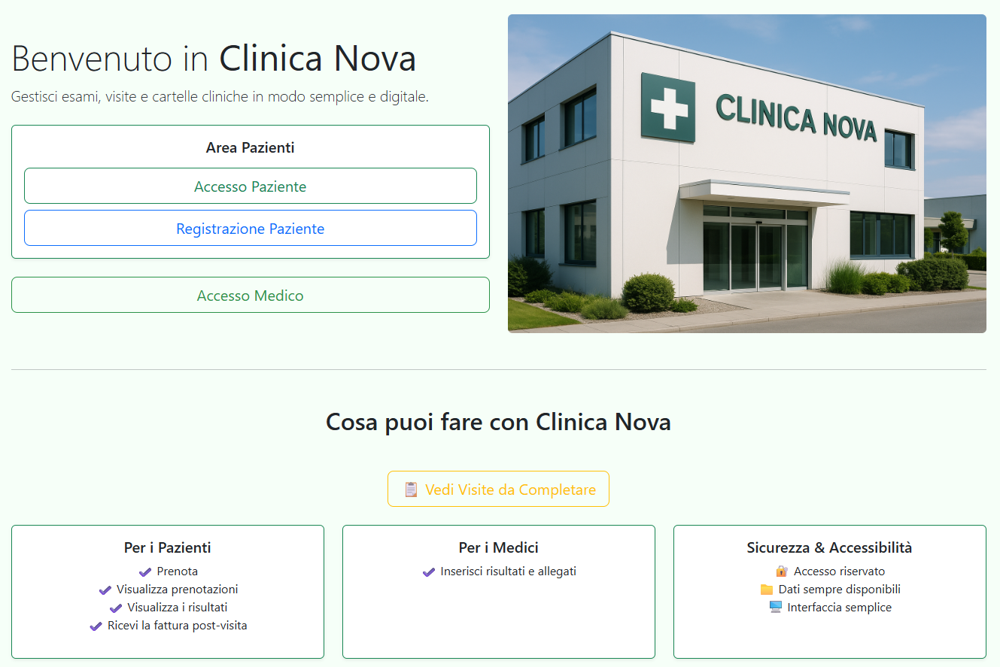
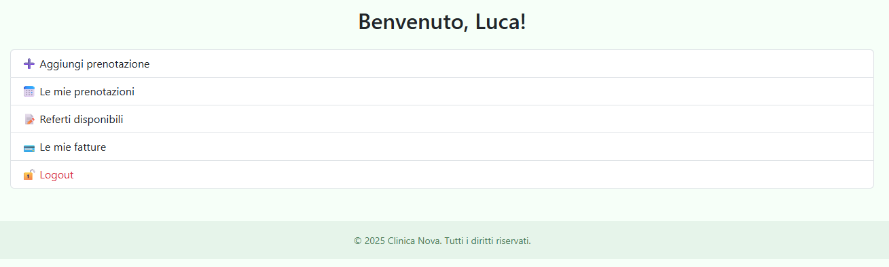
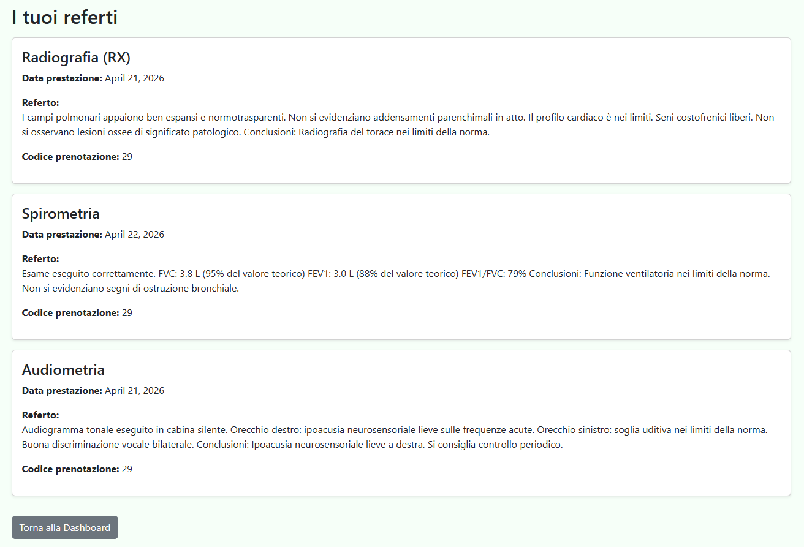

# 🏥 Clinica Nova – Gestionale Medico in Django

[📄 **Clicca qui per aprire la documentazione PDF completa**](https://github.com/RosarioVenerusoParthenope/CentroMedicoNova/blob/main/Presentazione%20Progetto%20Clinica%20Nova/progetto%20clinica%20nova.pdf)

---
**Clinica Nova** è un gestionale medico completo sviluppato in Django, pensato per semplificare la gestione di visite specialistiche, referti medici e fatturazione in formato digitale.

L'applicazione consente:
- ai **pazienti** di registrarsi, prenotare esami, scaricare referti e fatture in PDF,
- ai **medici** di gestire le prestazioni assegnate e compilare i referti in maniera intuitiva,
- e agli **amministratori** di avere una gestione centralizzata del centro medico.

> 🎓 Progetto realizzato a scopo didattico per il corso universitario – Università degli Studi di Napoli Parthenope.


## 🖼️ Screenshot

### 🔹 Homepage


### 🔹 Dashboard paziente


### 🔹 Referti e fattura


## ⚙️ Installazione dell’applicazione

🔽 Clona il progetto

```bash
git clone https://github.com/RosarioVenerusoParthenope/CentroMedicoNova.git
cd CentroMedicoNova
```


Crea ambiente virtuale
```bash
python -m venv venv
source venv/bin/activate       # Linux/macOS oppure prova python3 -m venv venv

venv\Scripts\activate          # Windows
```

Installa le dipendenze
```bash
pip install -r requirements.txt
```


Applica le migrazioni e avvia il server
```bash
python manage.py migrate
python manage.py runserver

```

🔗 Apri http://127.0.0.1:8000 nel browser per utilizzare l’app.


## 🧰 Tecnologie Utilizzate
Python 3.12

Django 5.2.1

SQLite (DB predefinito)

HTML + CSS (template base)

Bootstrap 5 (via CDN)

ReportLab + xhtml2pdf (per generazione PDF)

Git + GitHub


## 📘 Manuale d’uso – Come usare l’app

### 👤 Accesso Paziente
I pazienti possono registrarsi direttamente dalla homepage.

Una volta registrati e loggati, possono:

📝 Prenotare uno o più esami

📅 Visualizzare lo storico delle prenotazioni

📄 Consultare i referti (una volta compilati)

🧾 Scaricare le fatture in PDF

### 🧪 Esami disponibili

-Ecocardiogramma
-Elettrocardiogramma
-RX torace
-Spirometria
-Test da sforzo
-Risonanza magnetica
-Ecografia addominale

### 🩺 Accesso Medico
Per testare le funzionalità da medico, accedi con una delle seguenti credenziali:

| Nome    | Email                                             | Password   | Specializzazione     |
| ------- | ------------------------------------------------- | ---------- | -------------------- |
| Luca    | [lrossi@clinica.it](mailto:lrossi@clinica.it)     | luca123    | Radiologia           |
| Elena   | [eferrari@clinica.it](mailto:eferrari@clinica.it) | elena456   | Radiologia           |
| Chiara  | [cbianchi@clinica.it](mailto:cbianchi@clinica.it) | chiara789  | Cardiologia          |
| Marco   | [mconti@clinica.it](mailto:mconti@clinica.it)     | marco321   | Cardiologia          |
| Alberto | [averdi@clinica.it](mailto:averdi@clinica.it)     | alberto654 | Pneumologia          |
| Giulia  | [ggalli@clinica.it](mailto:ggalli@clinica.it)     | giulia987  | Medicina dello sport |


## 🔄 Test del ciclo completo

### 1. 🔐 Registrazione del paziente
Accedi alla homepage e registrati inserendo tutti i dati richiesti.

### 2. 🧪 Prenotazione esami
Una volta loggato, accedi alla Dashboard paziente → clicca su Prenota visita
Seleziona uno o più esami da prenotare.

### 3. 📋 Visualizza le prenotazioni
Vai in Le mie prenotazioni per vedere l’elenco delle visite effettuate o prenotate.

### 4. ⛔ Referti e fattura non visibili
Finché tutti gli esami non sono stati refertati, il paziente non potrà vedere i referti né scaricare la fattura.

### 5. 👀 Verifica i medici assegnati
Accedi alla sezione Visite da effettuare per scoprire quali medici sono stati assegnati agli esami.

### 6. 👨‍⚕️ Login come medico
Fai logout

Accedi con uno dei medici assegnati (vedi tabella sopra)

Vai in Gestione prestazioni e inserisci il referto per ogni esame assegnato

💡 Per semplicità, puoi provare il sistema con un solo esame, ma funziona anche con più esami per prenotazione.

### 7. 📥 Paziente rientra
Una volta che tutti i referti sono stati compilati:

Il paziente potrà vederli nella sezione I miei referti

Sarà disponibile anche la fattura scaricabile in PDF

## 📌 Note Finali
⚠️ Il progetto è a scopo didattico, pertanto alcune logiche (es. assegnazione automatica dei medici, date fittizie) sono state semplificate per agevolare la comprensione del flusso.

---

## 📄 Licenza

Questo progetto è distribuito con [licenza MIT](LICENSE).

Se vuoi contribuire, riutilizzare o distribuire il codice, è necessario mantenere i crediti e rispettare i termini della licenza.
